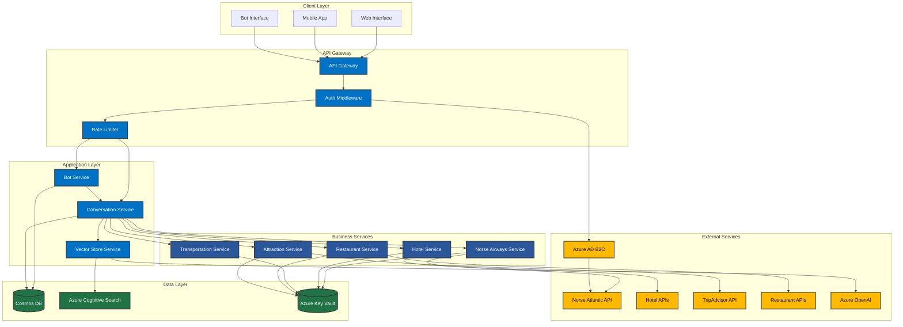

# Norse Atlantic Airways Travel Booking Chatbot

A comprehensive travel booking chatbot that provides a seamless booking experience for Norse Atlantic Airways customers, integrated with hotel bookings, transportation, and local activities.

## Features

- User authentication with Norse Atlantic Airways accounts
- Natural language conversation flow
- Flight booking with fare options and add-ons
- Hotel recommendations based on location preferences
- Airport transportation options
- Restaurant reservations
- Local attraction suggestions
- Complete itinerary management

## Technical Architecture



### Architecture Components

#### Client Layer
- **Web Interface**: React-based web application
- **Mobile App**: Native mobile applications
- **Bot Interface**: Bot Framework channels integration

#### API Gateway
- **API Gateway**: Request routing and load balancing
- **Auth Middleware**: JWT validation and Norse Atlantic account integration
- **Rate Limiter**: Request throttling and DDoS protection

#### Application Layer
- **Bot Service**: Handles bot interactions and message processing
- **Conversation Service**: Manages conversation state and flow
- **Vector Store Service**: Handles support content search and retrieval

#### Business Services
- **Norse Airways Service**: Flight booking and management
- **Hotel Service**: Hotel search and booking
- **Transportation Service**: Ground transportation booking
- **Restaurant Service**: Restaurant reservations
- **Attraction Service**: Local activities and attractions

#### Data Layer
- **Cosmos DB**: User data, conversation state, and bookings
- **Azure Cognitive Search**: Vector search for support content
- **Azure Key Vault**: Secure credential management

#### External Services
- **Norse Atlantic API**: Flight booking and management
- **Hotel APIs**: Property search and booking
- **TripAdvisor API**: Attraction information
- **Restaurant APIs**: Dining reservations
- **Azure OpenAI**: Natural language processing
- **Azure AD B2C**: Norse Atlantic account authentication

### Data Flow

1. **Authentication Flow**
   - User authenticates via Norse Atlantic account
   - B2C validates credentials and issues JWT
   - Token used for subsequent API calls

2. **Conversation Flow**
   - User message received by Bot Service
   - Conversation Service processes message
   - Vector Store Service searches for relevant content
   - Response generated using OpenAI
   - State updated in Cosmos DB

3. **Booking Flow**
   - User initiates booking request
   - Relevant service (Norse, Hotel, etc.) processes request
   - External API called for availability
   - Booking confirmed and stored in Cosmos DB
   - Confirmation sent to user

4. **Support Content Flow**
   - User query received
   - Vector Store Service generates embedding
   - Azure Cognitive Search finds relevant content
   - Content used to enhance response

## Architecture

The solution is built using Azure services and OpenAI:

### Azure Services
- Azure Bot Service
  - Handles bot registration and channel integration
  - Manages bot authentication and security
  - Provides built-in analytics and monitoring
- Azure AD B2C
  - Norse Atlantic Airways account integration
    - Single Sign-On (SSO) with Norse Atlantic Airways
    - Loyalty program integration
    - Booking history synchronization
    - Frequent flyer status verification
  - User identity and access management
  - Custom user flows and policies
  - Multi-factor authentication
  - Password reset and profile management
  - Token-based authentication
  - User profile attributes and custom claims
- Azure OpenAI Service
  - GPT-4 for natural language understanding and generation
  - Embeddings for semantic search and content matching
  - Function calling for structured data extraction
- Azure Cosmos DB
  - Stores user profiles and preferences
  - Manages conversation state and history
  - Handles booking records and itineraries
- Azure App Service
  - Hosts the web application
  - Provides auto-scaling and load balancing
  - Enables continuous deployment
- Azure Key Vault
  - Securely stores API keys and credentials
  - Manages secrets rotation
  - Provides access control for sensitive data
- Azure Application Insights
  - Monitors application performance
  - Tracks user interactions and errors
  - Provides analytics and reporting
- Azure Cognitive Search
  - Vector search for support content
  - Semantic search capabilities
  - Real-time indexing and updates

### Technical Components

#### 1. Conversation Management
- **ConversationService**: Manages the state and flow of conversations
  - Tracks user context and preferences
  - Handles multi-turn dialogs
  - Integrates with vector search for support content
  - Manages conversation history

#### 2. Natural Language Processing
- **OpenAI Integration**
  - GPT-4 for understanding user intent
  - Embeddings for semantic similarity
  - Function calling for structured data
  - Prompt engineering for consistent responses

#### 3. Vector Search
- **VectorStoreService**: Handles support content search
  - Generates embeddings for content
  - Performs vector similarity search
  - Manages content updates and indexing
  - Integrates with Azure Cognitive Search

#### 4. Data Management
- **DatabaseService**: Manages data persistence
  - CRUD operations for all entities
  - Transaction management
  - Data validation and sanitization
  - Connection pooling and optimization

#### 5. Authentication & Authorization
- **Azure AD B2C Integration**
  - Norse Atlantic Airways Account Integration
    - SSO with Norse Atlantic Airways
    - Loyalty program data synchronization
    - Booking history access
    - Frequent flyer status verification
    - Travel preferences sync
  - User Registration and Sign-in
    - Norse Atlantic Airways account linking
    - Email verification
    - Password policies and complexity rules
    - Account recovery options
  - User Profile Management
    - Profile synchronization with Norse Atlantic
    - Travel preferences
    - Loyalty program details
    - Booking history
    - Frequent flyer status
  - Token Management
    - JWT token generation and validation
    - Refresh token handling
    - Token lifetime management
    - Scope-based access control
  - Security Features
    - Multi-factor authentication
    - Risk-based conditional access
    - Fraud detection
    - Account lockout protection
  - User Flows
    - Norse Atlantic account linking
    - Sign-in flow
    - Password reset flow
    - Profile editing flow
    - Email verification flow
  - Policy Configuration
    - Custom policies for Norse Atlantic integration
    - Identity provider federation
    - Claims transformation
    - User journey customization

#### 6. External API Integration
- **FlightService**: Norse Atlantic Airways API
  - Flight search and booking
  - Fare calculation
  - Seat selection
  - Booking management

- **HotelService**: Hotel booking APIs
  - Property search
  - Room availability
  - Booking management
  - Cancellation handling

- **TransportationService**: Ground transportation
  - Airport transfers
  - Local transportation
  - Booking management
  - Route optimization

- **RestaurantService**: Dining reservations
  - Restaurant search
  - Table availability
  - Booking management
  - Special requests

- **AttractionService**: Local activities
  - Attraction search
  - Ticket booking
  - Tour packages
  - Reviews and ratings

## Technical Stack

### Frontend
- React.js with TypeScript
  - Component-based architecture
  - State management with Redux
  - Responsive design
  - Progressive Web App capabilities

### Backend
- Node.js with Express
  - RESTful API design
  - Middleware architecture
  - Error handling
  - Request validation

### Database
- Azure Cosmos DB
  - Document-based storage
  - Global distribution
  - Automatic scaling
  - Multi-model support

### Authentication
- Azure AD B2C
  - Primary Identity Provider
    - Norse Atlantic Airways accounts
    - SSO integration
    - Loyalty program data
    - Booking history
    - Frequent flyer status
  - User Flows
    - Account linking with Norse Atlantic
    - Sign-in with Norse Atlantic credentials
    - Password reset
    - Profile editing
    - Email verification
  - Security Features
    - Multi-factor authentication
    - Risk-based conditional access
    - Fraud detection
    - Account protection
  - Custom Policies
    - Norse Atlantic integration scenarios
    - Custom user journeys
    - Claims transformation
    - Identity provider federation
  - User Profile
    - Norse Atlantic account details
    - Loyalty program information
    - Travel preferences
    - Booking history
    - Consent management
  - Token Management
    - JWT token handling
    - Refresh token rotation
    - Token lifetime policies
    - Scope-based access

### API Integration
- Norse Atlantic Airways API
  - RESTful endpoints
  - OAuth 2.0 authentication
  - Rate limiting
  - Error handling

- Hotel APIs
  - Property search
  - Availability checking
  - Booking management
  - Cancellation handling

- TripAdvisor API
  - Attraction data
  - Reviews and ratings
  - Photo galleries
  - User recommendations

## Setup Instructions

1. Clone the repository
2. Install dependencies:
   ```bash
   npm install
   ```
3. Set up environment variables:
   ```bash
   cp .env.example .env
   ```
4. Configure Azure services:
   - Create Azure AD B2C tenant
     - Configure Norse Atlantic Airways identity provider
     - Set up SSO integration
     - Configure user flows
     - Define custom policies
     - Configure application registration
   - Create Azure Bot Service
   - Set up Azure OpenAI Service
   - Configure Azure Cosmos DB
   - Set up Azure Key Vault
   - Create Azure Cognitive Search service
5. Start the development server:
   ```bash
   npm run dev
   ```

## Project Structure

```
├── src/
│   ├── components/        # React components
│   │   ├── chat/         # Chat interface components
│   │   ├── booking/      # Booking form components
│   │   ├── auth/         # Authentication components
│   │   │   ├── norse/    # Norse Atlantic auth components
│   │   │   ├── profile/  # Profile management
│   │   │   └── loyalty/  # Loyalty program integration
│   │   └── common/       # Shared components
│   ├── services/         # API services
│   │   ├── bot/         # Bot framework services
│   │   ├── database/    # Database operations
│   │   ├── auth/        # Authentication services
│   │   │   ├── b2c/     # Azure AD B2C integration
│   │   │   ├── norse/   # Norse Atlantic auth integration
│   │   │   ├── flows/   # User flow handlers
│   │   │   └── tokens/  # Token management
│   │   └── external/    # External API integrations
│   ├── models/          # Data models and types
│   ├── utils/           # Utility functions
│   │   ├── auth/       # Authentication utilities
│   │   ├── validation/ # Input validation
│   │   └── helpers/    # Helper functions
│   └── pages/          # Page components
├── public/             # Static assets
├── tests/             # Test files
│   ├── unit/         # Unit tests
│   ├── integration/  # Integration tests
│   └── e2e/         # End-to-end tests
└── docs/             # Documentation
    ├── api/         # API documentation
    ├── setup/       # Setup guides
    └── architecture/# Architecture diagrams
```

## API Integration

The chatbot integrates with the following external services:

### Norse Atlantic Airways Booking API
- Flight search and availability
- Fare calculation and booking
- Seat selection and management
- Booking modifications and cancellations

### Hotel Booking APIs
- Property search and filtering
- Room availability checking
- Booking management
- Special requests handling

### TripAdvisor API
- Attraction information
- Reviews and ratings
- Photo galleries
- User recommendations

### Restaurant Reservation APIs
- Restaurant search
- Table availability
- Booking management
- Special requests

## Security

- Authentication and Authorization
  - Norse Atlantic Airways account integration
  - Azure AD B2C for identity management
  - Multi-factor authentication
  - Risk-based conditional access
  - Token-based security
  - Role-based access control
  - Session management
  - Secure token storage
- Data Protection
  - Data encryption at rest and in transit
  - Regular security audits and updates
  - Rate limiting and DDoS protection
  - Input validation and sanitization
  - Secure credential management
  - Privacy compliance (GDPR, CCPA)

## Contributing

Please read CONTRIBUTING.md for details on our code of conduct and the process for submitting pull requests.

## License

This project is licensed under the MIT License - see the LICENSE file for details.
